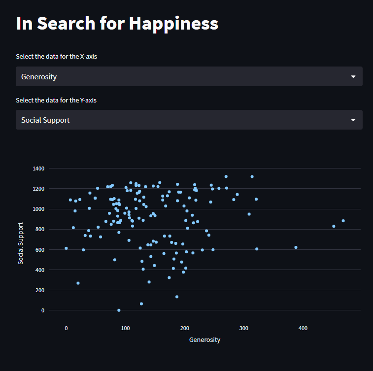

# 😊 Search for happiness

This is a simple app built using Python, Streamlit, Pandas, and Plotly Express. 
The app reads a CSV file containing data on happiness, GDP, generosity, social support, and life expectancy. 
User can select the data for the X-axis and Y-axis and a scatter plot will be generated using Plotly Express.

### 👩‍💻 Installation and Usage
1. Clone the repository or download the code.
2. Install the required libraries by running in terminal `pip install -r requirements.txt`.
3. Run the app by running in terminal `streamlit run main.py`.
4. Select the data for the X-axis and Y-axis using the dropdown menus.
5. The scatter plot will be generated below the dropdown menus.

`technologies used:`
`Python`
`Streamlit`
`pandas`
`plotly`

`version 1.0`

`released: 21.03.2023`

